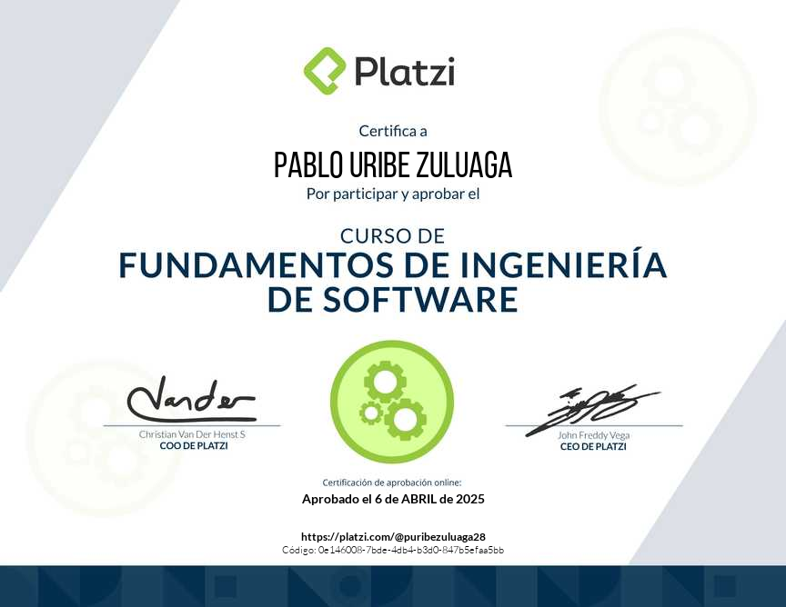
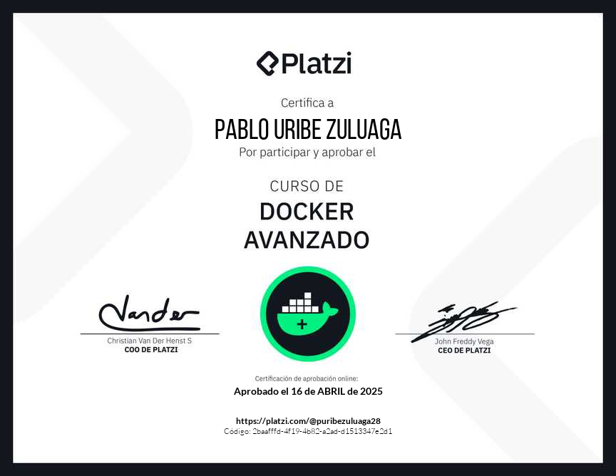

# Pablo Uribe Zuluaga
>  Systems engineering (Student)

I am studying Systems Engineering at Universidad Autónoma de Manizales in Colombia, currently coursing seventh semester.

I am a fullstack developer focused on backend development, with experience in JavaScript and TypeScript, and I am currently learning Python for Data Science and AI.

## :computer: Skills
### Tools

### Backend

### Frontend

<!-- ### Data Science and AI
 -->

### Infrastructure

 

&nbsp;

### :books: Certificates

<table style="width:100%; border:none; gap: 0px;">
  <tr>
    <td style="border:none;"></td>
    <td style="border:none;"></td>
    <td style="border:none;"></td>
  </tr>
  <tr>
    <td style="border:none;"></td>
    <td style="border:none;"></td>
    <td style="border:none;"></td>
  </tr>
  <tr>
    <td style="border:none;"></td>
  </tr>
</table>

<!-- website here -->
## :globe_with_meridians: Website

## :envelope: Contact
