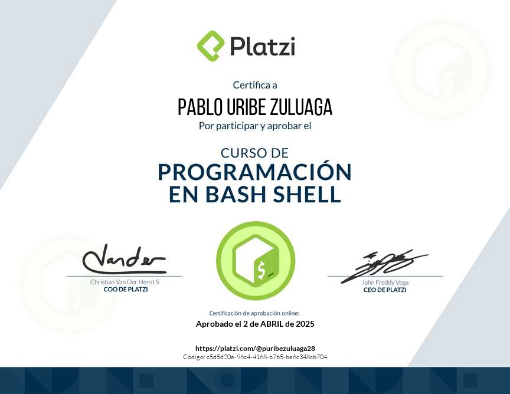
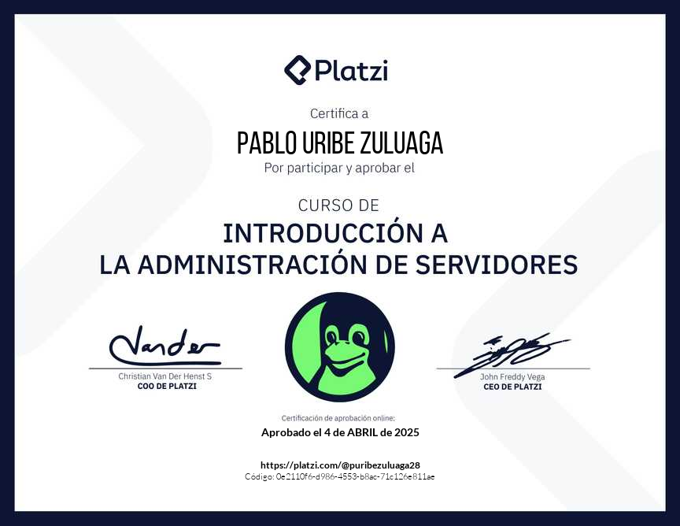
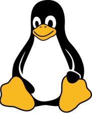

# Pablo Uribe Zuluaga
>  Systems engineering (Student)

I am studying systems engineering at Universidad Autónoma de Manizales in Colombia, currently coursing seventh semester.

I like developing my own tools and challenge me with projects.
Also, I have a [YouTube](https://www.youtube.com/channel/UC62Vw-ATtv01Pgk2yHvLjdg) channel, where I upload programming videos in spanish.

In College, I developed the website [Aprende Programacion](https://pablouz.github.io/AprendeProgramacion) using <strong>Angular</strong>, where you can learn programming basics, so if you're interested, you can continue learning by yourself.
 
 

&nbsp;

### Certificates
<!-- div display tabla -->

<table style="width:100%; border:none; gap: 0px;">
  <tr>
    <td style="border:none;"></td>
    <td style="border:none;"></td>
    <td style="border:none;"></td>
  </tr>
  <tr>
    <td style="border:none;"></td>
    <td style="border:none;"></td>
  </tr>
</table>

    
    &nbsp;
    
    &nbsp;
    
    &nbsp;
    
    &nbsp;
    

 
 
 
 

    &nbsp;&nbsp;
    &nbsp;&nbsp;
    &nbsp;&nbsp;
    &nbsp;&nbsp;
    &nbsp;&nbsp;
    &nbsp;&nbsp;

